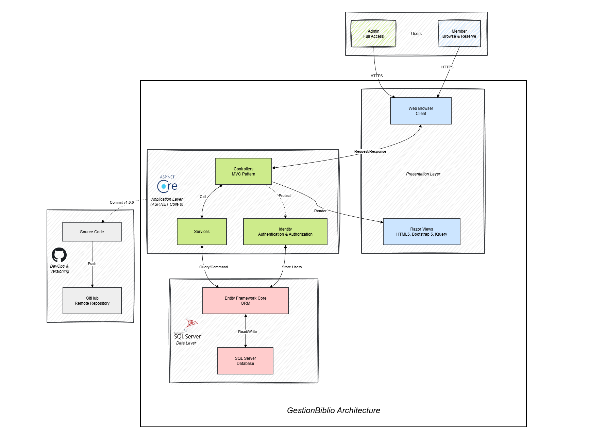

# GestionBiblioDotNet

A comprehensive Library Management System built with ASP.NET Core MVC. This application provides a full-featured interface for managing a library's books, members, loans, reservations, and fines.

## Overview

GestionBiblioDotNet is designed to modernize library operations. It caters to both administrators (librarians) and members. Administrators can manage the entire catalog and user base, while members can browse books, make reservations, and track their loan status.



### Key Features

*   **Book Management**:
    *   Add, edit, and delete books.
    *   Categorize books (Roman, Science-Fiction, etc.).
    *   Track number of copies and availability.
*   **Member Management**:
    *   Register and manage library members.
    *   View member history and current status.
*   **Loan System (Emprunts)**:
    *   Issue loans to members.
    *   Track due dates and return dates.
    *   **Automatic status updates** for overdue items.
*   **Reservations**:
    *   Members can reserve books that are currently unavailable.
    *   Manage reservation queues.
*   **Fines (Amendes)**:
    *   Automatically calculate fines for late returns used on a daily rate.
    *   Track payment status of fines.
*   **Dashboard**:
    *   Quick overview of library statistics.

## Technology Stack

*   **Framework**: ASP.NET Core 8.0 (MVC)
*   **ORM**: Entity Framework Core
*   **Database**: SQL Server
*   **Authentication**: ASP.NET Core Identity
*   **Frontend**: Razor Views, Bootstrap 5, jQuery

## Setup Guide

### Prerequisites
*   [.NET 8.0 SDK](https://dotnet.microsoft.com/download/dotnet/8.0)
*   [SQL Server](https://www.microsoft.com/sql-server/sql-server-downloads) (Express or Developer edition)
*   Visual Studio 2022 or VS Code

### Installation

1.  **Clone the repository**:
    ```bash
    git clone https://github.com/aminecharro01/GestionBiblioDotNet.git
    cd GestionBiblioDotNet
    ```

2.  **Configure Database**:
    Update the connection string in `appsettings.json` if your SQL Server instance is different from `(localdb)\\mssqllocaldb`.
    ```json
    "ConnectionStrings": {
      "DefaultConnection": "Server=(localdb)\\mssqllocaldb;Database=GestionBiblio;Trusted_Connection=True;MultipleActiveResultSets=true"
    }
    ```

3.  **Apply Migrations**:
    Initialize the database and apply migrations.
    ```bash
    dotnet ef database update --project GestionBiblio
    ```
    *Note: If you don't have the EF tool installed, run `dotnet tool install --global dotnet-ef`.*

4.  **Run the Application**:
    ```bash
    dotnet run --project GestionBiblio
    ```
    The application will typically start at `https://localhost:7001` or `http://localhost:5000`.

## Testing & Seed Data

The application includes an automatic seeder that populates the database with initial data on startup.

### Fake Accounts
Use these credentials to test the different roles:

**1. Administrator**
*   **Email**: `admin@gestionbiblio.com`
*   **Password**: `AdminP@ssw0rd`
*   *Access*: Full control over books, members, loans, and settings.

**2. Member**
*   **Email**: `membre@test.com`
*   **Password**: `Test@1234`
*   *Access*: Can browse catalog, view own loans, and make reservations.

### Test Scenarios
The `membre@test.com` account comes pre-seeded with:
*   **Late Loan**: A copy of "1984" that is overdue.
*   **Active Loan**: A copy of "Dune" currently on loan.
*   **Unpaid Fine**: A fine for a previously returned late book ("Clean Code").
*   **Reservations**: Active reservations for "Les Misérables" and "Le Seigneur des Anneaux".

## Connect with me
[LinkedIn Profile](https://www.linkedin.com/in/charroamine/)
